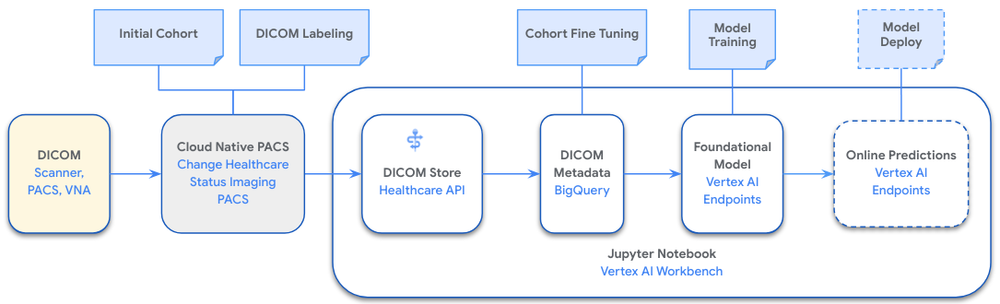

# Google Cloud Medical Imaging ML Development Accelerators

## Contents

1. [Overview](#overview)
2. [Diagram](#diagram)
3. [Label Datasets](#label-datasets)
4. [Deploy Notebook](#deploy-notebook)
5. [Takeaways](#takeaways)

## Overview

This notebook is derived from the [CXR Foundation](https://github.com/Google-Health/imaging-research/blob/master/cxr-foundation/) demo notebook. It leverages the [Change Healthcare Stratus Imaging PACS](https://www.changehealthcare.com/enterprise-imaging/stratus-imaging/pacs) for creating the annotated datasets in DICOM and the [Google Cloud Medical Imaging Suite (MIS)](https://cloud.google.com/medical-imaging) to process the labeled datasets and uptrain a foundation model. The purpose of this demo is to show that, by implementing this pattern and leveraging a combination of these capabilities on Google Cloud, you can rapidly accelerate the medical imaging ML development process.

### Medical Imaging Suite (MIS)

MIS provides integration patterns between clinical imaging systems and Google Cloud services that can be used to accelerate medical imaging ML data de-id, cohorting, labeling, training, and transform. Such services are the Healthcare API, Big Query, and Vertex AI.

### Change Healthcare Stratus Imaging PACS

Commercial PACS systems are already found in most enterprise imaging environments, as they are used for the majority of diagnostic radiology interpretation, and being able to leverage existing labeling capabilities through DICOM (KOS, GSPS, SR, SEG) as input to model training should accelerate the labeling process. These systems already have a tremendous amount of annotated data. The trick is being able to leverage it in a deterministic way. Additionally using this process will lead the result of the inference stage to being interoperable with what the PACS expects as input.

### Google Research CXR Foundational Model

Using foundation models accelerates the data curation and training pipeline development and runtime. Leveraging a foundation model means input data is less than a traditionally trained model, which means less data has to be labeled.

## Diagram

## Label datasets

In this demo we will be building a medical imaging model that predicts [Pneumothorax](https://radiopaedia.org/articles/pneumothorax?lang=us) using x-ray images. For this, we will label 200 x-ray studies for Pneumothorax in the Change Healthcare Stratus Imaging PACS by creating a DICOM Key Object Selection (KOS) for each image that presents positive. Studies negative for Pneumothorax will not contain a KOS.

In a real world scenario there will also be diagnostic report text available and if leveraging Google Cloud NLP or LLM APIs these can provide further pointers to studies of relevance based on findings.

In order to label images, you must have some images within your commercial system. We’ll be using images from the [NIH Chest X-ray dataset](https://cloud.google.com/healthcare-api/docs/resources/public-datasets/nih-chest), since it already has x-rays that are labeled with Pneumothorax, as well as other conditions. In this demo we will be following the existing labels and recreating them in the PACS system using the process above. This is to demonstrate that existing data and processes in DICOM within existing PACS systems can be used as readily labeled data ML training.

_The data that we are using in this demo is de-identified. You may use data with PHI if it is an approved option in your organization. There is also an option to use the [Healthcare API De-id](https://cloud.google.com/healthcare-api/docs/concepts/de-identification) if you are looking to de-id your DICOM data._

**NOTE:** If you don't have access to a Change Healthcare Stratus Imaging PACS system to do the labeling, then you can do one of the following:

- Request access to a test instance of the Change Healthcare Stratus Imaging PACS.
- Leverage staged sample data from `./data/staged/inputs/*.dcm` and skip to the [Prepare DICOM instances](./notebook.ipynb#prepare-dicom-instances) section

### Labeling datasets in Change Healthcare Stratus Imaging PACS

<table>
  <tr>
    <td width="45%">
      
    </td>
    <td>
      <ul>
        <li>Setup or get access to commercial PACS system. In this case we’re given access to a test organization in Change Healthcare Stratus Imaging PACS.</li>
        <li>In order to ingest and retrieve studies en masse, we must deploy an edge server so storage and retrieval of imaging data is easier vs exporting 1x1 through UI.</li>
        <li>Ingest images into PACS through the edge server. We’ll do this by taking 100 positive and 100 negative Pneumothorax studies, and doing a DICOM send (`storescu`) to the edge server.</li>
        <li>Label images in PACS, labeling each one with a key image / key object selection when there is Pneumothorax present. We’re going to assume any images that do not have a key image associated with them are not positive for Pneumothorax. We’re only labeling a small portion of studies because we want to be able to leverage the CXR foundation model.</li>
        <li>Once you've labeled the 100 positive Pneumothorax studies, it's time to export all of the studies to Healthcare API DICOM Store.</li>
      </ul>
    </td>
  </tr>
</table>

## Deploy Notebook

_At the end of the notebook we will have a modal that can detect Pneumothorax in X-ray images. Please note that this is only an example and in its current state it is ***not for diagnostic use***._

### Now it's time to deploy and run our [notebook](./notebook.ipynb)!

## Takeaways

- We hope this content has shown that a combination of PACS, MIS, and a foundation model, can accelerate multiple steps in the Medical Imaging AI development pipeline.
- Annotated data from a commercial PACS systems can be used as labeled data in an ML training pipeline as long as it is fully accessible and there is a deterministic transform, prioritizing DICOM.
